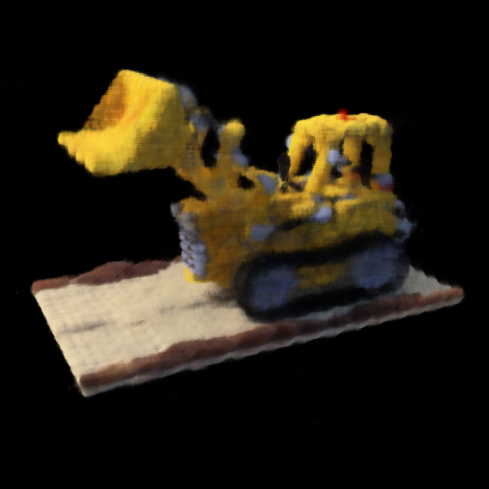

# og_nerf_scratch

This is the implementation of the original NeRF from scratch using PyTorch.

I tried to make it as simple as possible so this codebase can be a code starting point to learn and implement nerf.

## Demo

## Setup

## Usage

## Limitation

## TODO
1. Feature: Hierarchical volume sampling
1. Feature: Progressive learning rate decay
1. Feature: Multi-scale training
1. Feature: Add SSIM, PSNR, and RMSE evaluation metrics
1. Feature: Compare results with the original nerf paper
1. Feature: Fast preview rendering

## Contribution
1. Hamid Mohammadi: <hamid4@ualberta.ca>
