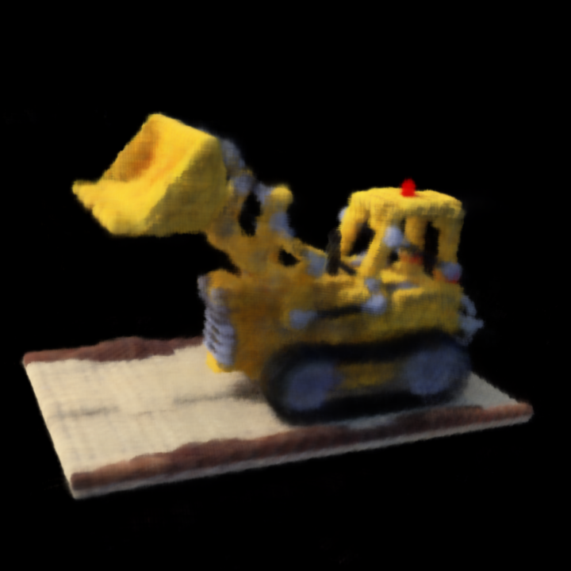
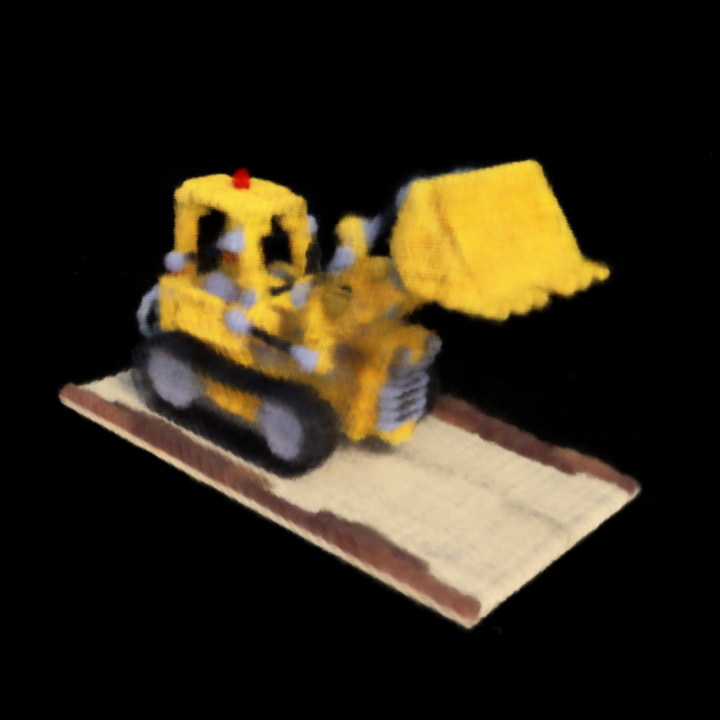

# Original NeRF from scratch using PyTorch

This is the implementation of the original NeRF from scratch using PyTorch.

I tried to make it as simple as possible so this codebase can be a code starting point to learn and implement nerf.

Thanks to https://github.com/yenchenlin/nerf-pytorch which I used as a reference.

## Demo

<div style="display: flex; justify-content: space-between;">
  
  
</div>

## Setup

Tested on Ubuntu 22.04.
Nvidia Driver version: 535.183.01


```bash
conda env create -f environment.yml
conda activate og_nerf
```

## Usage

Download the sample data first:

```bash
sh download_sample_data.sh
```

For training:

```bash
python3 train.py -c ./configs/train.yml
```

To render:

```bash
python3 render.py
```

## Limitation

1. Currently only works with the logo dataset. Custom loaders needed for other datasets.
1. Only uses uniform sampling.
1. Doesn't utilize course and fine sampling.
1. No view dependent rendering yet.
1. No support for multi-GPU training.
1. No support for visualizing the training process.
1. No support for visualizing the loss during training.

## TODO
1. Feature: View-dependent rendering
1. Feature: Hierarchical volume sampling
1. Feature: Progressive learning rate decay
1. Feature: Multi-scale training
1. Feature: Add SSIM, PSNR, and RMSE evaluation metrics
1. Feature: Compare results with the original nerf paper
1. Feature: Fast preview rendering


## Contribution
1. Hamid Mohammadi: <hamid4@ualberta.ca>
